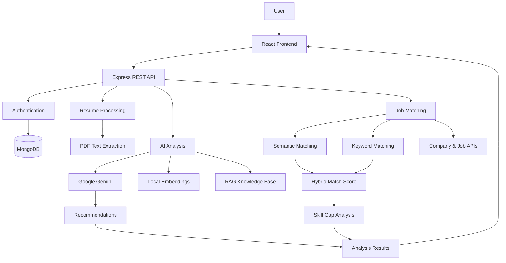

# HireLens

> **AI-powered resume intelligence and job matching platform.**

HireLens helps candidates understand how well their resume performs against ATS-style criteria and how closely it matches a target job. Users can upload a resume, provide a company and role or paste a job description, and receive actionable insights in one place.

### What HireLens provides

* ATS-style resume scoring
* Resume-to-job matching
* Semantic + keyword-based similarity analysis
* Skill-gap analysis
* AI-generated recommendations
* Evidence-grounded suggestions
* AI bullet-point improvement
* Company autocomplete
* Job posting lookup
* Secure authentication and resume management

---

## Architecture



### Request Flow

```text
Resume PDF
    │
    ▼
PDF Text Extraction
    │
    ▼
Structured Resume Data
    │
    ├───────────────┐
    ▼               ▼
Resume Analysis   Job Description
    │               │
    │         ┌─────┴─────┐
    │         ▼           ▼
    │     Semantic     Keyword
    │     Matching     Matching
    │         └─────┬─────┘
    │               ▼
    │        Hybrid Match Score
    │               │
    └───────┬───────┘
            ▼
     AI Recommendations
            │
            ▼
      Final Analysis
```

---

## AI & Matching Approach

HireLens uses different techniques for different tasks rather than relying on a single AI call.

| Technique                     | Purpose                                                                                                          |
| ----------------------------- | ---------------------------------------------------------------------------------------------------------------- |
| **LLM structured extraction** | Converts resume content into structured skills, education, experience, projects, and other relevant information. |
| **Local sentence embeddings** | Measures semantic similarity between a resume and a job description.                                             |
| **Keyword matching**          | Captures exact terms that are important for ATS-style evaluation.                                                |
| **Hybrid scoring**            | Combines semantic and keyword signals into a single job-match score.                                             |
| **RAG**                       | Grounds recommendations using an ATS-focused knowledge base.                                                     |
| **Evidence validation**       | Ensures recommendations are supported by information present in the resume.                                      |

### Hybrid Job Match

```text
Job Match Score
       │
       ├── 60% Semantic Similarity
       │
       └── 40% Keyword Similarity
```

This approach helps capture both exact matches such as `Kubernetes` and related concepts such as `REST API development` and `backend API development`.

---

## Core Features

### Resume Analysis

Upload a PDF resume and extract relevant information such as:

* Skills
* Education
* Work experience
* Projects
* Certifications
* Technologies

The extracted data is then used throughout the analysis process.

### ATS Analysis

The resume is evaluated across areas such as:

* ATS compatibility
* Content quality
* Structure
* Tone and style
* Skills

The result includes scores and practical recommendations for improvement.

### Job Matching

Users can enter a company and job title or provide a job description directly.

HireLens combines semantic and lexical matching to estimate how closely the resume aligns with the role.

### Skill Gap Analysis

The analysis highlights:

* Matched skills
* Missing skills
* Important missing skills

This provides a clearer picture of what needs to be improved for a specific role.

### AI Recommendations

Recommendations are generated using both the resume content and ATS-oriented knowledge.

The system also validates supporting evidence before including a recommendation in the final analysis.

### Bullet Point Improver

Individual resume bullet points can be improved with AI-generated alternatives that focus on clarity, impact, relevance, and measurable outcomes.

### Company & Job Lookup

Company autocomplete can assist while entering a company name.

The application can also retrieve a relevant job posting and use its description as a starting point for analysis. The retrieved content remains editable.

---

## Tech Stack

### Frontend

* React 19
* React Router
* TypeScript
* Tailwind CSS
* Vite
* Zustand
* React Dropzone
* PDF.js

### Backend

* Node.js
* Express.js
* MongoDB
* Mongoose
* JWT
* bcrypt
* Multer
* Zod
* Helmet
* Express Rate Limit
* Compression
* MongoDB query sanitization

### AI / ML

* Google Gemini
* Transformers.js
* Sentence embeddings
* Hybrid semantic + keyword matching
* Retrieval-Augmented Generation (RAG)

### External Services

* MongoDB Atlas / MongoDB
* Google Gemini
* Clearbit Autocomplete
* Adzuna Jobs API

### Tooling

* pnpm
* Git
* Docker
* Docker Compose

---

## Project Structure

```text
hirelens/
│
├── client/
│   ├── app/
│   │   ├── routes/
│   │   │   ├── home.tsx
│   │   │   ├── auth.tsx
│   │   │   ├── signup.tsx
│   │   │   ├── upload.tsx
│   │   │   ├── resume.tsx
│   │   │   └── wipe.tsx
│   │   │
│   │   ├── components/
│   │   │   ├── Navbar.tsx
│   │   │   ├── FileUploader.tsx
│   │   │   ├── CompanyAutocomplete.tsx
│   │   │   ├── ResumeCard.tsx
│   │   │   ├── Summary.tsx
│   │   │   ├── ATS.tsx
│   │   │   ├── Details.tsx
│   │   │   ├── JobMatch.tsx
│   │   │   ├── Recommendations.tsx
│   │   │   └── BulletImprover.tsx
│   │   │
│   │   └── lib/
│   │       ├── apiClient.ts
│   │       ├── authStore.ts
│   │       ├── resumeApi.ts
│   │       ├── jobsApi.ts
│   │       └── useRequireAuth.ts
│   │
│   └── types/
│       └── index.d.ts
│
├── server/
│   └── src/
│       ├── config/
│       │   └── db.js
│       │
│       ├── models/
│       │   ├── User.js
│       │   ├── Resume.js
│       │   └── Analysis.js
│       │
│       ├── controllers/
│       │   ├── authController.js
│       │   ├── resumeController.js
│       │   ├── analysisController.js
│       │   └── jobsController.js
│       │
│       ├── routes/
│       │
│       ├── middleware/
│       │   ├── auth.js
│       │   ├── upload.js
│       │   ├── validate.js
│       │   ├── rateLimit.js
│       │   └── errorHandler.js
│       │
│       ├── services/
│       │   ├── llmService.js
│       │   ├── extractionService.js
│       │   ├── feedbackService.js
│       │   ├── matchService.js
│       │   ├── keywordService.js
│       │   ├── embeddingService.js
│       │   ├── ragService.js
│       │   ├── recommendationService.js
│       │   ├── bulletImprovementService.js
│       │   ├── pdfService.js
│       │   ├── companyService.js
│       │   └── jobPostingService.js
│       │
│       └── knowledge/
│           └── kb.json
│
├── docs/
│   └── API.md
│
├── docker-compose.yml
├── .gitignore
└── README.md
```

---

## Getting Started

### Prerequisites

Make sure you have:

* Node.js 20+
* pnpm
* MongoDB or MongoDB Atlas
* Google Gemini API key

Check your versions:

```bash
node -v
pnpm -v
```

---

### 1. Clone the Repository

```bash
git clone https://github.com/<your-username>/hirelens-ai.git
cd hirelens-ai
```

---

### 2. Install Backend Dependencies

```bash
cd server
pnpm install
```

---

### 3. Configure Backend Environment

Create the environment file:

```bash
cp .env.example .env
```

Add the required values:

```env
PORT=5000
NODE_ENV=development
CLIENT_ORIGIN=http://localhost:5173

MONGODB_URI=your_mongodb_connection_string

JWT_SECRET=your_jwt_secret
JWT_EXPIRES_IN=7d
COOKIE_NAME=hirelens_token

GEMINI_API_KEY=your_gemini_api_key
GEMINI_MODEL=gemini-flash-latest

MAX_UPLOAD_MB=10

COMPANY_AUTOCOMPLETE_URL=https://autocomplete.clearbit.com/v1/companies/suggest

ADZUNA_APP_ID=
ADZUNA_APP_KEY=
ADZUNA_COUNTRY=us
```

Only the variables required by your environment need to be configured.

---

### 4. Start the Backend

```bash
pnpm dev
```

The API runs on:

```text
http://localhost:5000
```

On the first AI-powered analysis, the local embedding model may need to download and cache.

---

### 5. Install Frontend Dependencies

Open a new terminal:

```bash
cd client
pnpm install
```

---

### 6. Configure Frontend Environment

```bash
cp .env.example .env
```

Set the backend API URL:

```env
VITE_API_URL=http://localhost:5000
```

---

### 7. Start the Frontend

```bash
pnpm dev
```

The application will be available at:

```text
http://localhost:5173
```

---

## Docker

The application can also be started using Docker Compose.

From the project root:

```bash
cp server/.env.example server/.env
```

Configure the required environment variables and run:

```bash
docker compose up --build
```

This starts the required services for local development.

---

## API Overview

### Authentication

```http
POST /api/auth/signup
POST /api/auth/login
POST /api/auth/logout
GET  /api/auth/me
```

### Resumes

```http
POST   /api/resumes
GET    /api/resumes
GET    /api/resumes/:id/file
GET    /api/resumes/:id/preview
DELETE /api/resumes/:id
```

### Analysis

```http
POST   /api/analyses
GET    /api/analyses
GET    /api/analyses/:id
DELETE /api/analyses/:id
POST   /api/analyses/improve-bullet
```

### Jobs

```http
GET /api/jobs/companies?q=google
GET /api/jobs/find-posting?company=Google&title=Software+Engineer
```

For detailed API information, see:

```text
docs/API.md
```

---

## Security

HireLens follows a backend-first security model.

### Authentication

JWT authentication is stored in an `httpOnly` cookie so the token is not directly accessible to client-side JavaScript.

### Authorization

Resume files, previews, and analysis results are protected by ownership checks.

### Validation

Input data is validated on write endpoints using Zod schemas.

### Rate Limiting

Rate limits are applied to sensitive routes including authentication, AI analysis, job lookups, and general API traffic.

### Additional Protection

The backend also uses:

* Helmet security headers
* Password hashing with bcrypt
* MongoDB query sanitization
* Response compression
* Controlled CORS configuration
* Protected file access

---

## Performance

The analysis pipeline is designed to avoid unnecessary work.

### Parallel Processing

Independent analysis operations can run concurrently, reducing unnecessary waiting during a complete analysis.

### Duplicate Request Handling

Repeated analysis requests with the same input can reuse existing results instead of unnecessarily repeating expensive AI processing.

### Cached External Lookups

Company and job lookups can be cached to reduce repeated external requests.

### Optimized Resume Previews

Preview images are optimized for display while the original PDF is preserved for server-side extraction and analysis.

### Progress Feedback

The upload and analysis flow communicates the current processing stage so users know what the application is doing.

---

## Job Matching Workflow

```text
Company
   │
   ▼
Company Autocomplete
   │
   ▼
Company + Job Title
   │
   ▼
Optional Job Posting Lookup
   │
   ▼
Job Description
   │
   ├───────────────┐
   ▼               ▼
Semantic         Keyword
Similarity       Matching
   │               │
   └───────┬───────┘
           ▼
      Hybrid Score
           │
           ▼
     Skill Gap Analysis
           │
           ▼
    AI Recommendations
```

Job-posting lookup is designed as a convenience feature. Retrieved descriptions remain editable, allowing users to provide the complete job description when needed.

---

## Design

HireLens uses a dark visual system with green accents and glass-inspired UI components.

The interface focuses on:

* Clear information hierarchy
* Responsive layouts
* Consistent spacing
* Accessible focus states
* Reduced-motion support
* Reusable visual components
* Minimal visual clutter

---

## Deployment

### Backend

The Node.js backend can be deployed to platforms such as:

* Render
* Railway
* Fly.io
* VPS / Cloud VM

The backend requires its environment variables and a persistent storage strategy for uploaded files.

### Frontend

The React frontend can be deployed to:

* Vercel
* Netlify
* AWS S3 + CloudFront
* Other static hosting platforms

Set `VITE_API_URL` to the deployed backend URL during the build process.

### Database

MongoDB Atlas or another managed MongoDB provider can be used for production deployments.

For multi-instance deployments, uploaded files and in-memory caches should be moved to shared infrastructure such as object storage and Redis.

---

## Limitations

* Image-only or scanned PDFs are not processed without OCR.
* The first local embedding request may take longer while the model is downloaded and cached.
* Job-posting availability depends on the configured external service.
* AI output quality depends on the resume and job description provided.
* In-memory caching is intended for single-process deployments.

---

## Future Improvements

* Resume version comparison
* Multi-job resume comparison
* Personalized job recommendations
* Cover letter generation
* Interview preparation
* Application tracking
* Resume template builder
* Learning roadmaps based on skill gaps
* Background processing for large workloads
* Persistent caching and distributed infrastructure
* Advanced analytics and reporting

---

## Contributing

Contributions are welcome.

```bash
git checkout -b feature/your-feature
```

Make your changes, test them locally, and submit a pull request.

---

### License

Licensed under the **MIT License** — see [`LICENSE`](./LICENSE) for the full text. You're free to use, modify, and distribute this project, including commercially, with attribution.

---

## Author

Aditya Verma 

---

> **HireLens — Turn your resume into actionable career intelligence.**
